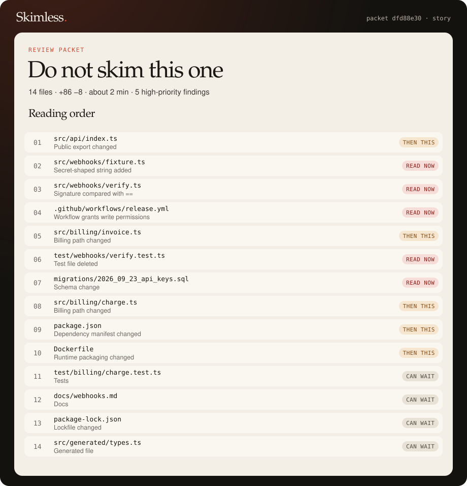

# Skimless

[](https://github.com/pedroofrancaa/skimless/actions/workflows/ci.yml)
[](https://www.npmjs.com/package/skimless)
[](LICENSE)

[English](README.md) · Português

**A ordem de leitura para pull requests que cresceram demais.**

O Skimless transforma um diff num pacote: o que ler primeiro, o que pode esperar e quais linhas merecem uma pessoa. Ele roda na sua máquina. Não chama modelo de IA, não posta comentário e não manda nada para lugar nenhum.

Zero dependências de runtime. Node.js 22 ou mais novo. Uma CLI, uma GitHub Action, uma biblioteca e um servidor MCP para agentes de IA. Pacotes em português e inglês.

```bash
npx skimless demo --lang pt
```

[](https://pedroofrancaa.github.io/skimless/prova.html)

```text
skimless  Não passa o olho nesse
14 arquivos · +86 −8 · cerca de 2 min. 5 achados em prioridade alta.
Primeira passada: index.ts, fixture.ts, verify.ts.

 1  src/api/index.ts                  Export público mudou
 2  src/webhooks/fixture.ts           String com cara de segredo adicionada
 3  src/webhooks/verify.ts            Assinatura comparada com ==
 4  .github/workflows/release.yml     Workflow concede permissão de escrita
 5  src/billing/invoice.ts            Caminho de cobrança mudou
 6  test/webhooks/verify.test.ts      Arquivo de teste apagado
 7  migrations/2026_09_23_api_keys.sql
 8  src/billing/charge.ts
 9  package.json                      Manifesto de dependências mudou
10  Dockerfile
11  test/billing/charge.test.ts       Pode esperar
12  docs/webhooks.md                  Pode esperar
13  package-lock.json                 Pode esperar
14  src/generated/types.ts            Pode esperar
```

O `verify.ts` do exemplo chama `timingSafeEqual` num buffer comparado com ele mesmo. O Skimless não tem regra para isso. Ele coloca o arquivo em terceiro, logo abaixo da chave com cara de real, para uma pessoa ver. Esse é o produto: um caminho pelo diff, não um veredito.

[Pacote em português](https://pedroofrancaa.github.io/skimless/prova.html) · [English packet](https://pedroofrancaa.github.io/skimless/proof.html) · [Um diff real: Express 4.21.2 → 5.0.0](https://pedroofrancaa.github.io/skimless/express-5.html)

## Por que isso existe

Pull requests feitos com agente ficam grandes. O revisor abre o primeiro arquivo, cansa e aprova o lockfile com o mesmo olhar que usaria numa migração. O Skimless mostra onde dá para passar o olho e onde não dá: a API pública primeiro, as bordas afiadas em seguida, o ruído no fim. A nota é prioridade de leitura. Um pacote quieto não prova que o diff está seguro.

## Como usar

```bash
npx skimless demo --lang pt
npx skimless demo --lang pt --format html --out skimless.html
npx skimless review --base origin/main --format all --out skimless --fail-on high --lang pt
```

Ou instale uma vez com `npm install -g skimless` e use o comando `skimless`.

`--format all` gera `skimless.html`, `skimless.md` e `skimless.json`. Strings com cara de segredo são mascaradas, a não ser que você passe `--no-redact`. O `--fail-on` é `none` por padrão na sua máquina. Na CI, use `high`.

Num diff gerado de 2.000 arquivos, o pacote sai em cerca de 100 ms num notebook. `npm run bench` mostra o número na sua máquina.

```js
import { redactPacket, reviewDiff } from "skimless";

const packet = redactPacket(reviewDiff(patch, { order: "story", lang: "pt", budgetMinutes: 25 }));
packet.readingOrder.forEach((stop) => console.log(stop.path, stop.reason));
```

## O que tem no pacote

- Uma ordem de leitura. O modo `story` é o padrão: API e tipos, depois auth, assinatura, cobrança, migrações e CI, depois manifestos, depois o resto, e por último testes, docs, lockfiles e código gerado. Um achado alto puxa o arquivo para a faixa do topo. O modo `risk` ordena só pela nota.
- Achados com o id da regra. São 21 regras, cada uma numa frase, cobrindo JavaScript, TypeScript, Python, Ruby, Go, PHP, Java, Kotlin, Rust e C#, além de GitHub Actions, GitLab CI e outros runners. Veja [docs/rules.md](docs/rules.md).
- Um HTML para anexar, um comentário em Markdown e um JSON para o que você já usa.

Copie [examples/skimless.config.json](examples/skimless.config.json) para `skimless.config.json` para definir o orçamento de tempo, os globs ignorados e o nível que faz a CI falhar.

## CI

```yaml
- uses: actions/checkout@v4
  with:
    fetch-depth: 0
- uses: pedroofrancaa/skimless@v1
  with:
    base: origin/${{ github.base_ref }}
    fail-on: high
    lang: pt
```

A Action não precisa de token e não posta comentário. A ordem de leitura e os achados aparecem no resumo do job, na aba Checks do pull request. Os inputs passam por variáveis de ambiente e chegam ao `git diff` como argumentos separados, nunca montados numa string de shell. Em [docs/ci.md](docs/ci.md) estão o workflow completo, todos os inputs e um job para GitLab CI.

## Usando com agentes de IA

`skimless mcp` é um servidor MCP. Claude Code, Cursor, VS Code e outros agentes podem pedir a ordem de leitura antes de revisar uma mudança e ler os arquivos nessa ordem.

```bash
claude mcp add skimless -- npx -y skimless mcp
```

O Skimless continua sem chamar modelo. Ele serve um. Strings com cara de segredo são sempre mascaradas nas respostas do MCP, então uma chave real no diff nunca chega ao contexto do agente. Em [docs/mcp.md](docs/mcp.md) estão a configuração de cada cliente, os argumentos das ferramentas e exemplos de pedidos que funcionam.

## O que ele não faz

- Não executa o diff.
- Não chama modelo de IA e não finge que uma heurística é um. Agentes podem chamar o Skimless; o Skimless não chama agentes.
- Não pega todo bug. A autocomparação do exemplo fica lá de propósito.
- Um rótulo quieto não é uma aprovação.

## Desenvolvimento

```bash
npm install
npm test
npm run check
node --experimental-strip-types src/cli.ts demo --lang pt
```

No dia a dia, a CLI roda o TypeScript direto. `npm run build` gera o `dist/`, que é o que vai para o npm.

As regras, a ordem de leitura e a API da biblioteca estão descritas em [docs/](docs/), em inglês. As notas para contribuir estão em [CONTRIBUTING.md](CONTRIBUTING.md). Issues e pull requests em português são bem-vindos. O projeto é MIT, nos termos do [GOVERNANCE.md](GOVERNANCE.md): um mantenedor no começo, decisões em público, sem comunidade de faz de conta.

## Licença

[MIT](LICENSE)
